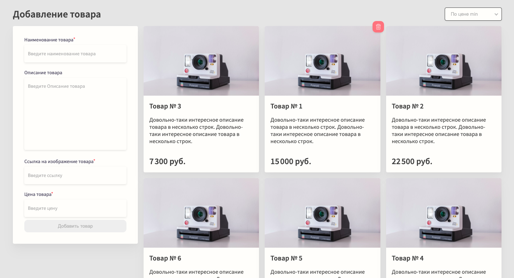

# Idaproject Frontend Test

This is my solution to the Frontend Developer Test for Idaproject.

### Table of Contents

- [Overview](#overview)
  - [The challenge](#the-challenge)
  - [Screenshot](#screenshot)
  - [Links](#links)
- [Development](#development)
  - [Built with](#built-with)
- [Author](#author)

## Overview

### The Challenge

Users should be able to:

- View the optimal layout for the app depending on their device's screen size
- See hover states for all interactive elements on the page
- Add new items to the list
- Validate user input
- Delete items from the list
- Save data on the backend (reloading does not remove all items)
- Filter by price and name

Technical requirements:

- Project has to be written in Vue
- Each component has to be a SFC
- No UI libraries allowed
- No HTML preprocessors allowed
- Only JS allowed
- Style section has to be scoped or use css-modules

### Screenshot

### Links

[Live Website](https://davidbraginsky.github.io/idaproject_frontend_test/)

## Development

### Built with

- Vue (3.2.13)
- SCSS
- Node (16.13.1)
- ESLint

To deploy app locally download files manually or clone the repository. Install all dependencies using `npm install`. Once all dependencies have been installed deploy app using `npm run serve`.

### Todo

- add fallback content for when all items were deleted (currently displays spinner)
- add thousands seperator (space) for input form (currently only in gallery output)

## Author

[@davidbraginsky](https://github.com/davidbraginsky)
